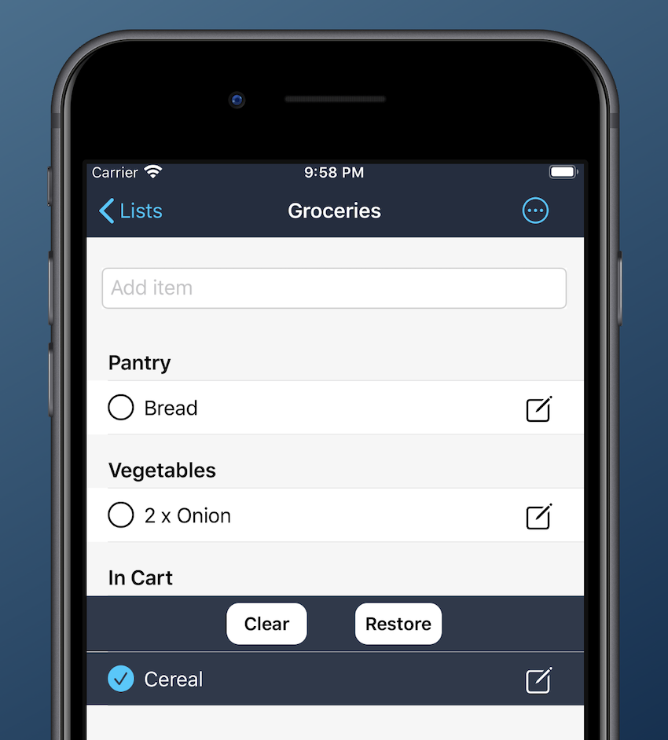

#  iShop

iShop is a shopping list app built using SwiftUI, available for iPhone, iPad and Mac. Compatible with iOS 14.0+ and MacOS 11.0+

The app features:
- iCloud sync
- Multiple lists
- Item categories
- Item quantities
- Item history (shared across lists)
- Ability to send lists via text, or copy list items
- A host of useful settings to enable customisation

Click [here](https://1drv.ms/v/s!ArD4GThUJSRbm80F2P2yXkRu1GV8lQ?e=0XEmGb) for a quick demo.

## Notes:
- Data persistence is done through core data.
- Syncronisation is done using iCloud (no login required from users, but doesn't support Android)
- UserDefaults sync using MKiCloudSync.
- Most functions were made global in Functions.swift (I only created methods inside a struct when I needed access to one of the struct's properties).
- All commits were pushed to the Development branch
- The Production branch is the Master branch. I aimed to only push to Production when a new version of the app went live on the App Store.

This was a project to test the viability of making a living as an independent iOS developer. While making apps was financially a dead-end, I learned a great deal and was able to demonstrate my enthusiasm for software development, helping me secure my first job as a Developer.

I still use the app today, and would have kept it on the app store, if not for the $150AU annual fee Apple charges.

This last image shows the XCode IDE and simulator running on MacOS.

